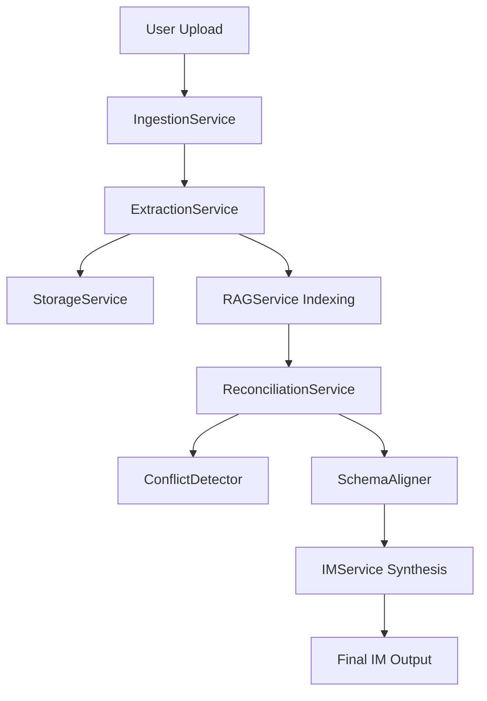

# System Architecture - Project Finance AI Engine

The Project Finance AI Engine is a modular platform designed to automate the synthesis of Information Memorandums (IM) from complex project documentation.

## Core Philosophical Principles
- **Modularity**: Logic is decoupled into specialized services (Conflict Detection, Schema Alignment, etc.) to ensure maintainability and testability.
- **Type-Safe Intelligence**: Utilization of Gemini's Structured Output ensures that LLM extractions adhere to strict Pydantic schemas.
- **Observability**: Centralized logging replaces ad-hoc print statements to provide production-grade monitoring.

## Component Overview

### 1. Ingestion & Extraction
- **IngestionService**: Orchestrates the flow from raw file upload to indexed knowledge.
- **ExtractionService**: Leverages **Docling** for high-fidelity structural extraction, capturing precise bounding box coordinates for every document element (text, tables, headings).

### 2. Intelligence Layer
- **ReconciliationService**: The "brain" of the platform.
    - **ConflictDetector**: Categorizes facts and applies truth-heuristics (e.g., Doc Recency, Heuristic Keywords) to resolve data discrepancies.
    - **SchemaAligner**: Uses semantic string matching to normalize disparate terms into a unified project schema.
    - **Pinpoint Mapping**: Uses verbatim quotes to map extracted facts back to physical document coordinates.
- **RAGService**: Custom retrieval pipeline using **Supabase pgvector**. Performs semantic search on atomic document chunks while preserving layout metadata for pinpoint citations.

### 3. Synthesis Layer
- **IMService**: Generates structured IM drafts using Gemini 2.0. Supports dynamic tone adjustment and ensures that generated citations carry coordinate metadata to the frontend.

### 4. Data Layer
- **SupabaseService**: The unified backend for relational data, structural JSON (`docling_json`), and vector embeddings. Replaces decentralized storage with a consolidated PostgreSQL/pgvector stack.

## Data Flow Diagram

